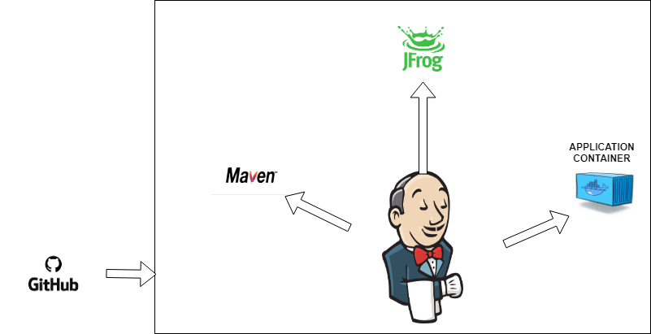
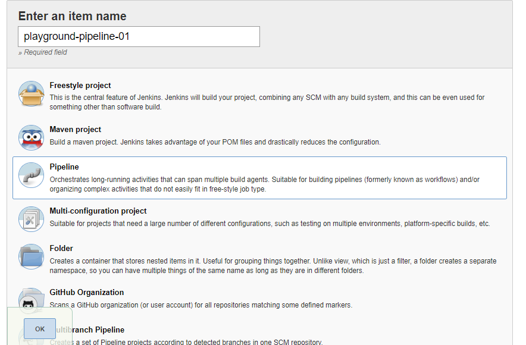

# Hands on with CI/CD with Jenkins Pipeline
## Overview

Jenkins is, fundamentally, an automation engine which supports a number of automation patterns. Pipeline adds a powerful set of automation tools onto Jenkins, supporting use cases that span from simple continuous integration to comprehensive CD pipelines. By modeling a series of related tasks, users can take advantage of the many features of Pipeline:

Code: Pipelines are implemented in code and typically checked into source control, giving teams the ability to edit, review, and iterate upon their delivery pipeline.

Durable: Pipelines can survive both planned and unplanned restarts of the Jenkins master.

Pausable: Pipelines can optionally stop and wait for human input or approval before continuing the Pipeline run.

Versatile: Pipelines support complex real-world CD requirements, including the ability to fork/join, loop, and perform work in parallel.

Extensible: The Pipeline plugin supports custom extensions to its DSL [1] and multiple options for integration with other plugins.


## Agenda

The aim of this lab is to demonstrate how to you provisining environment and application deployment in a Continuous Integration/Continuous Delivery (CI/CD) process using docker containers and Jenkins Pipeline respectively.

### The infrastucture Architecture



The tools used to create the examples for this lab are:
* **Docker** to create infrastructure for this lab
* **Maven** to set and deploy the Java project.
* **GIT** for source code management and control
* **JFrog Artifactory** is the repository for artifact binaries and docker images.
* **Jenkins** to orchestrate the CI/CD pipeline flow.


### Pipeline flow
Now let's explore the CI/CD pipeline flow built for this lab.


## Hands On!!
### Login to Jenkins Dashboard
You can skip this section if you are using your own Jenkins Dashboard.


### Configure Jenkins
* Add your Github Credentials
    Manage Jenkins > Configure >
* Add your JFrog Artifactory credentials
* Add Docker Server
* Configure Maven

### Creating the Pipeline

Navigate to left panel and click on **New Item**. Enter a unique job name and select Pipeline to create a pipeline job. Hit OK!


#### Stage 1: Prepare environment and pull code from GitHub
Next it will take to you to job configuration page, you need to configure your job with SCM.
* Copy your GitHub Repository link or if you are using this lab use: https://github.com/abha10/playground-pune-01.git
* Go back to your Job and under Pipeline configuration do the following steps
  1. Definition: select *Pipeline script from SCM*
  2. SCM: Select Git
       1. Repositories URL: <Paste URL>
       2. Credentials: Select your SCM credentials
       3. Additional Behaviour: Checkout to specific branch
          1. Type 'master' in it.
       4. Make sure you have your Script Path as Jenkinsfile
       5. Save all the changes

  3. Build your job

#### Stage 2: Build your code through Pipeline
This stage consists of following steps
* Build project with Maven Build and create snapshot artifact
* Create a project Snapshot
```
steps {
   sh 'mvn clean package'
    script{
      def snap_image =  docker.build("digitaldemo-docker-snapshot-images.jfrog.io/${JOB_NAME}:SNAPSHOT")
    }

}
```
 #### Stage 3: Deploy snapshot image to test environment

This stage consists of following steps
* Deloy the snapshot image in Test Envirnoment

 ```
 steps {
  script {
   app = docker.image("digitaldemo-docker-snapshot-images.jfrog.io/${JOB_NAME}:SNAPSHOT").withRun('-p 9000:9000 --name snapshot') {
    sh 'sleep 10'
    sh 'curl http://localhost:9000 || exit 1'

   }
  }

 }
 ```

 #### Stage 6: Release and Push releases to JFrog

This stage consists of following steps
* Once approved Prepare the snapshot for release
* And push relesease artifact and image into JFrog Artifactory
 ```
 when {
  expression {
   params.RELEASE
  }
 }
 steps {
   script {
    releasedVersion = getReleasedVersion()
      withCredentials([usernamePassword(credentialsId: 'github', passwordVariable: 'password', usernameVariable: 'username')]) {
        sh "git config user.email ecsdigitalpune@gmail.com && git config user.name Jenkins"
        sh "mvn release:prepare release:perform -Dusername=${username} -Dpassword=${password}"
      }

   def release_image = docker.build("digitaldemo-docker-release-images.jfrog.io/${JOB_NAME}:${releasedVersion}")
  }
 }

 ```

 ### Stage 7: Push release to Artifactory

 ```
 when {
  expression {
   params.RELEASE
  }
 }
 steps {
  script {
   // Create an Artifactory server instance:
   def server = Artifactory.server('abhaya-docker-artifactory')
   def uploadSpec = """{     "files": [{
    "pattern": "**/*.jar",
    "target": "ext-release-local/"
   }]
  }"""
  server.upload(uploadSpec)

  // Create an Artifactory Docker instance. The instance stores the Artifactory credentials and the Docker daemon host address:
  def rtDocker = Artifactory.docker server: server, host: "tcp://localhost:2375"

  // Push a docker image to Artifactory (here we're pushing hello-world:latest). The push method also expects
  // Artifactory repository name (<target-artifactory-repository>).
  def buildInfo = rtDocker.push "digitaldemo-docker-release-images.jfrog.io/${JOB_NAME}:${releasedVersion}", 'docker-release-images'

  //Publish the build-info to Artifactory:
  server.publishBuildInfo buildInfo
 }
}
 ```
 #### Stage 8: Deploy release to production environment

This stage consists of following steps
* Finally deploy your release into production environment

 ```
 when {
  expression {
   params.RELEASE
  }
 }
 steps {
  script {
   docker.image("digitaldemo-docker-release-images.jfrog.io/${JOB_NAME}:${releasedVersion}").run('-i -t -p 9000:9000 --name production')
  }
 }
}
 ```
